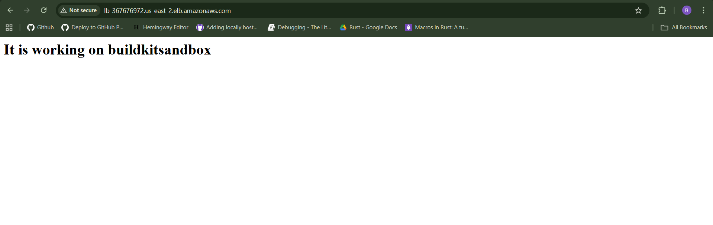

# Challenge 5: Basic CI/CD Pipeline for Dockerized Application 🏗️

## Objective
Design a basic Continuous Integration and Continuous Delivery (CI/CD) pipeline using local tools to automate the update of your web application.
This challenge combines CI/CD, Docker, Monitoring (Testing), and Automation (Scripting).


## The Scenario
The startup now has a stable, scalable infrastructure, but updating the "Coming Soon" page requires manual steps (building, pushing, SSHing, running commands). Your task is to conceptualize and script a streamlined process that validates a new version of the code and then deploys the new container image to the existing AWS infrastructure (from Challenge 4) without tearing down the resources.


## The Challenge
1. CI Script (Build & Test): Draft a Shell Script or Makefile snippet that performs the Continuous Integration (CI) steps:
- Build: Builds a new Docker image for the application, tagging it with a dynamic version number (e.g., based on the current date/time or Git commit SHA, use a placeholder).
- Local Test: Runs the newly built container locally and uses curl to verify that both the main page (/) and the /health endpoint return a successful HTTP response (Status code 200).
- Cleanup: Stops and removes the temporary local container after testing.
2. CD Script (Deployment): Describe the high-level Continuous Delivery (CD) process to update the application on the AWS Auto Scaling Group (ASG) infrastructure:
- Goal: Trigger a rolling update of the ASG to use the new image without downtime.
- Mechanism: Explain what specific AWS resource you must update in Terraform (or manually via AWS CLI) to trigger the ASG to launch new instances with the new container image. State the necessary steps (e.g., push image, update resource, wait). You do not need to write the Terraform code for the update, just the required AWS action.

## Your Deliverable:
The Shell Script/Makefile snippet for the CI process (Build, Test, Cleanup).
The step-by-step description of the CD process, focusing on the single AWS resource change that triggers the rolling update.


This challenges your ability to think sequentially and use scripting for automation. Good luck!


## Solution

We have our Dockerfile image and terraform configuration ready from previous challenges and in this challenge we have to create a shell script through which can build a new image with dynamic version number and also check whether it is working fine or not.

### CI Script
So we will start by creating a script called `ci.sh`, inside which we will have below mentioned content
```bash

#!/bin/bash
cat pat.txt | docker login -u rajrishab --password-stdin
cd /home/raj/Documents/terraform/challenge5/docker
version=$(curl -L --fail "https://hub.docker.com/v2/<USERNAME>/<IMAGE_NAME>/challenge2/tags/?page_size=1000" |     jq '.results | .[] | .name' -r |     sed 's/latest//' |      sort --version-sort |   tail -n 1)
major_version=$(echo "$version" | awk -F '.' '{print $1}')
minor_version=$(echo "$version" | awk -F '.' '{print $2 + 1}')

if [ $minor_version -le 8 ]; then
    minor_version=$(echo "$minor_version" | awk '{$1 = $1 + 1; print $1}')
else
    major_version=$(echo "$major_version" | awk '{$1 = $1 + 1; print $1}')
    minor_version=0
fi
new_tag=$(echo "rajrishab/challenge2:$major_version.$minor_version")
echo $new_tag
docker build -t $new_tag .
docker stop temp
docker rm temp
docker run -dit --name temp -p 80:80 $new_tag
# curl -I -w "%{http_code}\n" http://localhost
if [ $(curl -o /dev/null -s -w "%{http_code}\n" http://localhost) -eq 200 ]; then
    if [ $(curl -o /dev/null -s -w "%{http_code}\n" http://localhost/health/) -eq 200 ]; then
        # docker push $new_tag
        echo "endpoints are working fine"
    else
        echo "endpoint /health/ are not working fine"
    fi
else
echo "endpoint / are not working fine"
fi


```


First we have logged into git using below command which uses Personal Access Token as password 
`cat pat.txt | docker login -u rajrishab --password-stdin`

In the above script we are trying to get the latest version of our docker image using the below command 

`curl -L --fail "https://hub.docker.com/v2/repositories/<USERNAME>/<IMAGE_NAME>/tags/?page_size=1000" |     jq '.results | .[] | .name' -r |     sed 's/latest//' |      sort --version-sort |   tail -n 1`

and then increment the version number by `0.1` everytime we are running the script using below command

```bash
major_version=$(echo "$version" | awk -F '.' '{print $1}')
minor_version=$(echo "$version" | awk -F '.' '{print $2 + 1}')

if [ $minor_version -le 8 ]; then
    minor_version=$(echo "$minor_version" | awk '{$1 = $1 + 1; print $1}')
else
    major_version=$(echo "$major_version" | awk '{$1 = $1 + 1; print $1}')
    minor_version=0
fi
```

after that we are creating the new tag of our image which we will use to run our container and push the image to DockerHub as well, 

```bash
new_tag=$(echo "rajrishab/challenge2:$major_version.$minor_version")
echo $new_tag
docker build -t $new_tag .
```

after that we are bulding our image and testing whether it is working fine or not, if it is working fine then we are pushing the image to DockerHub otherwise are priting the error message using below commands
```bash
docker build -t $new_tag .
docker stop temp
docker rm temp
docker run -dit --name temp -p 80:80 $new_tag
# curl -I -w "%{http_code}\n" http://localhost
if [ $(curl -o /dev/null -s -w "%{http_code}\n" http://localhost) -eq 200 ]; then
    if [ $(curl -o /dev/null -s -w "%{http_code}\n" http://localhost/health/) -eq 200 ]; then
        docker push $new_tag
        echo "endpoints are working fine"
    else
        echo "endpoint /health/ are not working fine"
    fi
else
echo "endpoint / are not working fine"
fi
```


### CD Process

#### 1. First approach
In order to update the EC2 instances with our latest image we need to update the launch template which we have created in terraform config

for that we have to update the userdata which are passing to launch template with the latest image tag as shown below 

`sudo docker run -p 80:80 --name tempo <NEW_IMAGE_TAG>`

then apply the terraform config using `terraform apply`

and after that we have to update refresh the template instance in our ASG telling it to update instances i.e., create new instances one by one using the latest launch templates

`aws autoscaling start-instance-refresh --auto-scaling-group-name ASG1 --strategy Rolling --preferences '{"MinHealthyPercentage": 50, "InstanceWarmup": 300}' --region us-east-2`


one thing to note here is that your launch template in terraform config should have below, it ensures that the default version which ASG uses to create new instances will match the latest version of the launch instances.

`update_default_version = true`


after that ASG will terminate the old instances and create the new instances and automatically add it to target group so that we can access it through ALB.


#### 2. Second approach
In order to automate the CD process to update the comming soon page we need to add the folllowing:

First of all change our userdata.sh which is a static file to template file(userdata.tftpl) like mentioned below 


```bash
#!/bin/bash
sudo dnf update -y
sudo dnf install -y docker
sudo usermod -aG docker ec2-user
sudo systemctl start docker
sudo docker run -p 80:80 --name tempo ${image_tag}
echo "running"
```

After that we need to update our shell script and add the below mentioned command inside the nested if statement, this command executes the `terraform apply -var="image_tag=$new_tag" -auto-approve` command which does not ask for `yes` and also passes the latest images tag which we have created so that terraform will detect the change and automatically update the launch template and apply the changes to terraform and refresh the template

```bash
    docker push $new_tag
    echo "endpoints are working fine"
    cd /home/raj/Documents/DevOps-Challenges/challenge5
    terraform init
    terraform plan
    terraform apply -var="image_tag=$new_tag" -auto-approve
    aws autoscaling start-instance-refresh --auto-scaling-group-name ASG1 --strategy Rolling --preferences '{"MinHealthyPercentage": 50, "InstanceWarmup": 300}' --region us-east-2

```


and update our terraform config by adding a variable block and updating the launch_template block as following

```bash


variable "image_tag" {
  type = string
  default = "rajrishab/challenge2:1.0"
}


resource "aws_launch_template" "launch_template"{
  name = "launch_template"
  image_id = data.aws_ssm_parameter.latest_al2023_ami.value
  instance_type = "t2.micro"

  network_interfaces{
    associate_public_ip_address = true
    security_groups = [aws_security_group.SG1.id]
  }
  update_default_version = true

  user_data = filebase64(templatefile("${path.module}/userdata.tftpl",{
    image_tag = var.image_tag
  }))
}

```

## Conclusion
We have create a shell script which will automatically create a new image and push it to DockerHub and also we have prepared the necessary commands which we can use to update our EC2 instance whenever we make changes to our docker images.

You can find the config and scripts in the [repo](https://github.com/Rishab49/DevOps-Challenges)

