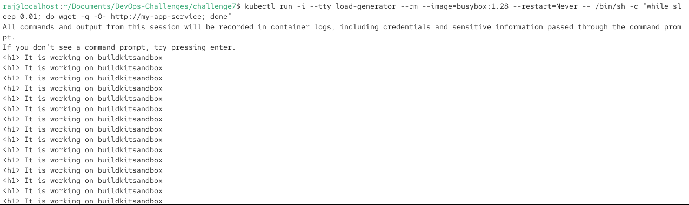
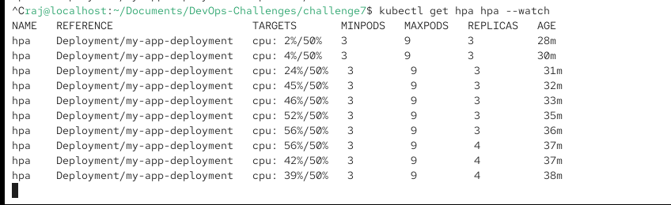

# Challenge 7: Scaling and Monitoring in Kubernetes 📈

## Objective
Implement automatic scaling and basic monitoring hooks within your existing Kubernetes deployment to handle variable load.

This challenge focuses on the final layer of Kubernetes reliability: Scaling and Observability.

## The Scenario
Now that the application is running in Kubernetes, the team needs to ensure it scales vertically with CPU usage and that metrics can be easily scraped.

## The Challenge
Horizontal Pod Autoscaler (HPA): Write the single YAML manifest for a Horizontal Pod Autoscaler (HPA) resource that manages the web-app-deployment.

- Scale Range: Set the minimum number of replicas to 1 and the maximum number of replicas to 5.

- Metric: Scale the application when the average CPU utilization across all pods exceeds 50%.

- Resource Limits (Verification): Explain why defining resources.limits and resources.requests (which you did correctly in Challenge 6) is a prerequisite for the HPA based on CPU utilization to function correctly.

Basic Observability Hook: Describe how you would integrate the application (which exposes a /metrics or similar endpoint) with a standard Prometheus monitoring stack running in the same cluster. What is the key annotation you must add to the Service or Pod metadata to enable Prometheus scraping?

## Your Deliverable:

The complete HPA YAML manifest file (hpa.yaml).

A brief explanation (1-2 sentences) of the HPA prerequisite.

The necessary Kubernetes annotation for Prometheus scraping and where it belongs.

This challenge ties together your resource definitions and scaling policies. Good luck!


## Solution
We have deployed our image on a kubernetes cluster with 2 replicas in challeneg6 but having a constant number of pods will not help us for application for varying number of requests. We need a mechanism to scale the pods according to the resource utilization of our pods for better
- resource utilization
- cost optimization
- performance


So we can use HPA(Horizontal Pod Autoscaling) which is technique which is used to increase the number of pods as response to increase load on the cluster.


In kubernetes we define the HPA(type fo kubernetes API resource) configuration inside yaml file, which when executed creates an object inside cluster API server and stores the definition in etcd.

Now kube-controller-manager has a component called HPA controller which runs a continuous loop inside which it does the following
1. Read the HPA configuration
2. Fetches the current metrics data from the metrics server
3. Calculates the nexessary number of pods
4. write the required number of replica in target resource9 example Deployment)


note : here metric server is a pod which we can start in our cluster to fetch the realtime metrics of the pods in the cluster

`kubectl apply -f https://k8s.io/examples/application/php-apache.yaml`

or 

`minikube addons enable metrics-server`


After adding the metrics server and HPA configuration we can start our cluster and load test it, I have modified the configuration of kubernetes and added the following configs


```yaml
apiVersion: autoscaling/v2
kind: HorizontalPodAutoscaler
metadata:
  name: hpa
spec:
  scaleTargetRef:
    apiVersion: apps/v1
    kind: Deployment
    name: my-app-deployment 
  minReplicas: 3
  maxReplicas: 9
  metrics:
    - type: Resource
      resource:
        name: cpu
        target:
          type: Utilization
          averageUtilization: 50
```

In above configuation we have defined a HPA resource which minimum number of pods at 3 and max number of pods at 9, and the cluster has to maintain the average CPU utilization less than 50%.

When applied in the cluster the above configuation will create 3 pods at the starting then as the load of the cluster increases it will increase the number of pods.


we can stress test our cluster using the following command which makes continuous requests to our service which is running with the name `my-app-server`

`kubectl run -i --tty load-generator --rm --image=busybox:1.28 --restart=Never -- /bin/sh -c "while sleep 0.01; do wget -q -O- http://my-app-service; done"`

then we can monitor our HPA status in realtime using following command
`kubectl get hpa hpa --watch`


here the second `hpa` is the name of our HPA resource.


you will see output like following






Here as the load of the cluster exceed 50% mark HPA increase the number of replica in the deployment config which in turn to maintain the desired state of cluster also increase the number of pods according to its config.


## Basic obervability Hook

To integrate the prometheus monitoring stack with our running application we can create a ServiceMonitor which will listen on an endpoint on regulat intervals and we need to provide the service monitor with a matchLabel with app value as the label of our service. Also for the service monitor to get discovered by the by prometheus we need to add a label with release key and `kube-prometheus-stack` as value.


```yaml
apiVersion: monitoring.coreos.com/v1
kind: ServiceMonitor
metadata:
  name: spacelift-prometheus-servicemonitor
  labels:
    release: kube-prometheus-stack
spec:
  endpoints:
    - port: http
      path: /prometheus
      interval: 15s
  selector:
    matchLabels:
      app: spacelift-prometheus-demo
```